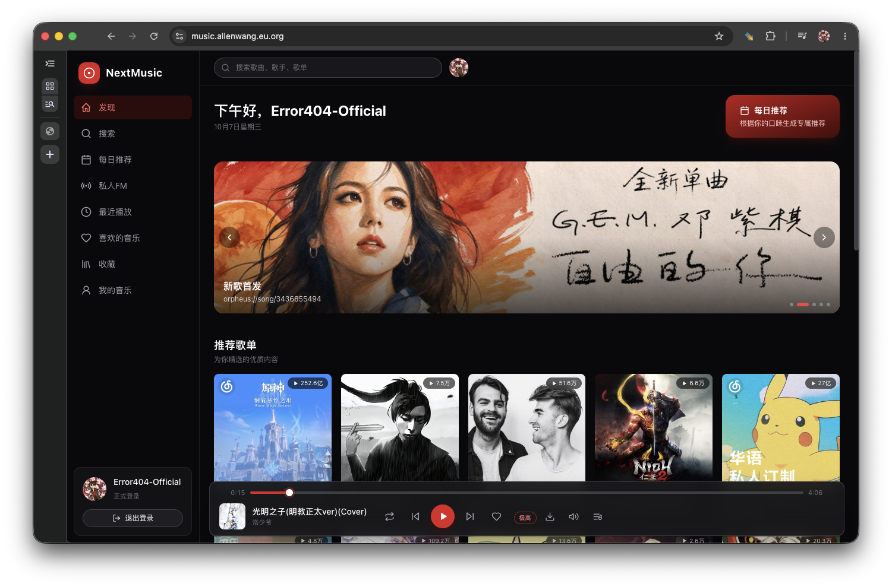

# NextMusic

基于网易云音乐的纯客户端 Web 音乐播放器：无自建后端，浏览器直连主NeteaseCloudMusicApi 兼容接口与 OuterAPI，登录态与播放降级全部在客户端处理。



## 功能特性

- **发现**：Banner 轮播、推荐 / 个性化歌单、排行榜、热门歌手
- **搜索**：热搜榜与搜索建议，支持单曲 / 专辑 / 歌手 / 歌单
- **每日推荐、私人 FM**：FM 支持跳过（垃圾桶"不再播放"），队列耗尽自动续播（需登录）
- **浏览**：歌单 / 专辑 / 歌手 / 用户主页，歌手热门歌曲、专辑列表、简介与相似歌手
- **我的音乐**：喜欢的音乐、最近播放、收藏的专辑与歌手
- **播放器**：播放条与全屏播放页（歌词 + 翻译开关）、播放队列抽屉、顺序 / 单曲循环 / 随机三种播放模式
- **音质**：标准至超清母带共 10 档可选（部分为 VIP 档，能否生效取决于账号与音源）
- **播放可靠性**：
  - 播放进度 ≥50% 时自动预缓存下一曲，命中后直接作为播放第 0 步
  - 播放降级链：预缓存命中 → 主 API `/song/url/v1/302` → OuterAPI，加载失败或命中试听片段（时长过短）自动推进下一步
- **下载**：优先获取下载直链（blob 下载），失败回退浏览器新标签页；不属于写操作，各登录模式均可用
- **键盘快捷键**：空格 播放 / 暂停，← / → 切歌，Ctrl/⌘ + ↑ / ↓ 音量调节（输入框聚焦时不劫持）
- **登录与权限**：手机号 / 邮箱 / 扫码 / 游客 / 虚拟登录；游客与虚拟模式为只读，写操作（喜欢、收藏、歌单编辑、FM 垃圾桶）统一拦截并提示

## 技术栈
Vue 3 + TypeScript + Vite + Pinia + Tailwind CSS；测试使用 Vitest 与 Playwright。

## 快速开始

环境要求：Node.js（本地验证环境为 Node ≥ 22），npm。

```bash
# 1. 安装依赖
npm install

# 2. 配置环境变量（VITE_MAIN_API 必填）
cp .env.example .env.local

# 3. 启动开发服务器
npm run dev
```

### 环境变量

| 变量 | 必填 | 说明 |
| --- | --- | --- |
| `VITE_MAIN_API` | 是 | 主 API 地址（构建时注入），例如自部署的 NeteaseCloudMusicApi Enhanced 实例；缺失时运行时直接抛错 |
| `VITE_OUTER_API` | 否 | OuterAPI 地址，默认 `https://nextmusic.toubiec.cn` |
| `VITE_OUTER_IP` | 否 | OuterAPI 携带的 `ip` 参数，默认为会话内随机中国 IP |

## 部署到 Vercel

[](https://vercel.com/new/clone?repository-url=https%3A%2F%2Fgithub.com%2Falanwang233233%2FNextMusic&env=VITE_MAIN_API&envDescription=%E4%B8%BB%20API%20%E6%9C%8D%E5%8A%A1%E5%99%A8%E5%9C%B0%E5%9D%80%EF%BC%8C%E4%BE%8B%E5%A6%82%20https%3A%2F%2Fyour-main-api.example.com&project-name=next-music&repository-name=NextMusic)

点击上方按钮即可一键克隆仓库并进入 Vercel 部署流程，或按以下步骤手动部署：

1. Fork 本仓库
2. 在 Vercel 控制台点击 **Add New → Project**，导入 fork 后的仓库
3. Framework Preset 会自动识别为 **Vite**（`vercel.json` 已配置构建命令）
4. 在 **Environment Variables** 中添加：
   - `VITE_MAIN_API` = 你的主 API 地址（必填，例如自部署的 NeteaseCloudMusicApi Enhanced 实例）
   - `VITE_OUTER_API` / `VITE_OUTER_IP`（可选，见 `.env.example`）
5. 点击 **Deploy**，构建完成后即可访问

> 注意：`VITE_MAIN_API` 是构建时变量，修改后需要重新触发部署才会生效。

## 可用脚本

| 命令 | 说明 |
| --- | --- |
| `npm run dev` | 启动开发服务器 |
| `npm run build` | 类型检查（`vue-tsc -b`）+ 生产构建，提交前必须通过 |
| `npm run typecheck` | 仅类型检查 |
| `npm run test` | Vitest 单元测试 + 组件测试 |
| `npm run test:unit` / `npm run test:components` | 分别运行单元 / 组件测试 |
| `npm run test:e2e` | Playwright E2E（需先 `npm run build`，跑的是 `vite preview` 服务的 `dist`） |
| `npm run test:visual` | 视觉截图测试（同样依赖最新 `dist`） |
| `npm run e2e:report` | 查看 Playwright 报告 |

## 架构概览

```
src/
├── api/          # 唯一网络层：主 API（mainApi）与 OuterAPI（outerApi）
├── player/       # 播放引擎（engine.ts）与下一曲预缓存（precache.ts）
├── stores/       # Pinia：auth / player / settings / toast
├── composables/  # 写操作守卫、全局键盘快捷键等
├── components/   # layout / music / player / ui 组件；图标统一走 AppIcon 内联 SVG
├── views/        # 路由页面（发现、搜索、FM、歌单、专辑、歌手、登录等）
├── config/       # 音质档位、码率映射等常量
├── utils/        # 下载、格式化、歌词解析
└── types/        # 领域模型
```

## 免责声明

本项目不是网易云官方项目，使用社区逆向接口，不受网易官方认可，接口随时失效，作者不保证可用或不封号。
本项目仅供学习交流使用，不存储任何音频文件；请支持正版音乐。使用本项目产生的所有账号风险、法律责任由使用者自行承担.
本项目禁止用于非法用途，使用时请务必遵守对应平台用户协议与版权法规。

## 开源许可

本项目基于 AGPL-3.0 license 许可进行开源。
AGPL-3.0 允许自由使用、修改与分发（包含商业场景），但修改后的衍生作品同样需要以 AGPL-3.0 协议开源。
